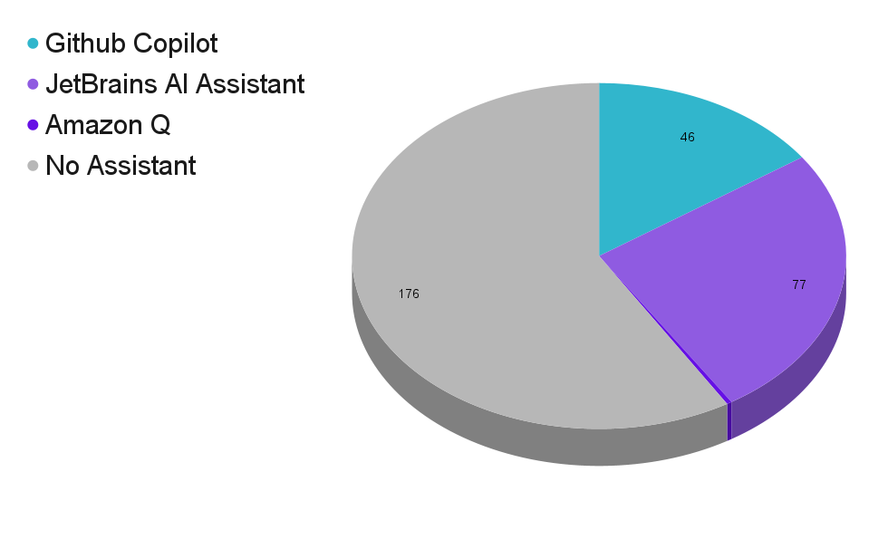

<!-- color: #333 -->
<!-- backgroundColor: #eee -->

# Beyond the IDE 
## Introducing AI Tools in our Development Flow

 
Filippos Karailanidis

@filkaris

---
# Who are we?

* Leading fintech company
* Specializes in Currency trading
* Offices in Cyprus, Greece, London, Dubai, Japan, USA
* Supports 30 languages
* 10+ Million clients worldwide
* 1400+ employees / 600+ IT 

---
# What tools are we using?

---
# What tools are we using?

    

        
        
Github Copilot

    

---
# What tools are we using?

    

        
        
Github Copilot

    

    

        
        
JetBrains AI Assistant

    

---
# What tools are we using?

    

        
        
Github Copilot

    

    

        
        
JetBrains AI Assistant

    

    

        
        
Amazon Q

    

---
# AI Tools Adoption

<pre class="mermaid arch">
timeline
    Aug, 2023: Github CoPilot
</pre>

---
# AI Tools Adoption

<pre class="mermaid arch">
timeline
    Aug, 2023: Github CoPilot
    Jan, 2024: JetBrains AI Assistant
</pre>

---
# AI Tools Adoption

<pre class="mermaid arch">
timeline
    Aug, 2023: Github CoPilot
    Jan, 2024: JetBrains AI Assistant
    Oct, 2024: Amazon Q
</pre>

---
# AI Tools Adoption

---
# What these tools do

---
# What these tools do - Autocomplete

---
# What these tools do - Autocomplete

---
# What these tools do - Chat

---
# What these tools do - Chat

---
# What these tools do - Chat with Context

---
# What these tools do - Chat with Context

---
# Use Cases

* Code Generation
* Code Generation with Context
* Code Review
* Bigger Picture

---
# Code Generation - Generate Code

---
# Code Generation - Generate Code

---
# Code Generation - Generate sample datasets

---
# Code Generation - Generate sample datasets

---
# Code Generation - Generate pipelines / infrastructure

---
# Code Generation - Generate pipelines / infrastructure

---
# Generation with Context - Unit Tests

---
# Generation with Context - Unit Tests

---
# Generation with Context - Unit Tests

---
# Generation with Context - Translate to another Language

---
# Generation with Context - Translate to another Language

---
# Generation with Context - Translate to another Language

---
# Generation with Context - Write Documentation

---
# Generation with Context - Write Documentation

---
# Generation with Context - Write Documentation

---
# Generation with Context - Debug

---
# Generation with Context - Debug

---
# Generation with Context - Debug

---
# Generation with Context - Debug

---
# Code Review - Quality

---
# Code Review - Quality

---
# Code Review - Quality

---
# Code Review - Quality

---
# Bigger Picture - Dependencies

---
# Bigger Picture - Dependencies

---
# Bigger Picture - Rate Project Structure

---
# Bigger Picture - Rate Project Structure

---
# Bigger Picture - Upgrade Java Version

---
# Bigger Picture - Upgrade Java Version

---
# Bigger Picture - Add a Feature

---
# Bigger Picture - Add a Feature

---
# AI Tool Awards

---
# AI Tool Awards

    

        
        
Github Copilot

    

    

        
        
JetBrains AI Assistant

    

    

        
        
Amazon Q

    

---
# AI Tool Awards

    

        
        
Github Copilot

         
        
&#127942; Best Autocomplete

    

    

        
        
JetBrains AI Assistant

    

    

        
        
Amazon Q

    

---
# AI Tool Awards

    

        
        
Github Copilot

         
        
&#127942; Best Autocomplete

    

    

        
        
JetBrains AI Assistant

         
        
&#127942; Best IDE Integration

    

    

        
        
Amazon Q

    

---
# AI Tool Awards

    

        
        
Github Copilot

         
        
&#127942; Best Autocomplete

    

    

        
        
JetBrains AI Assistant

         
        
&#127942; Best IDE Integration

    

    

        
        
Amazon Q

         
        
&#127942; Best Context Awareness

    

---
## Our Experience

* Positive in general
* Careful with hallucinations
* Not everyone embraces it
* Used mostly by Senior engineers
* Very fast iterations by the vendors

---
# Thank you!

